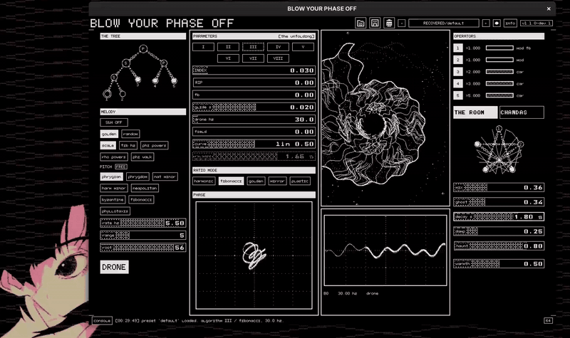
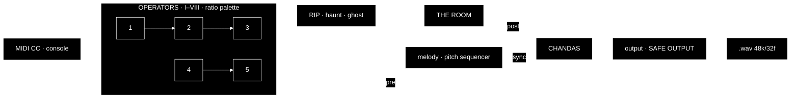
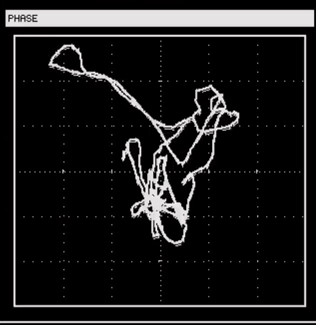
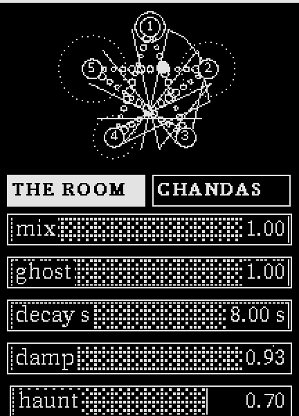
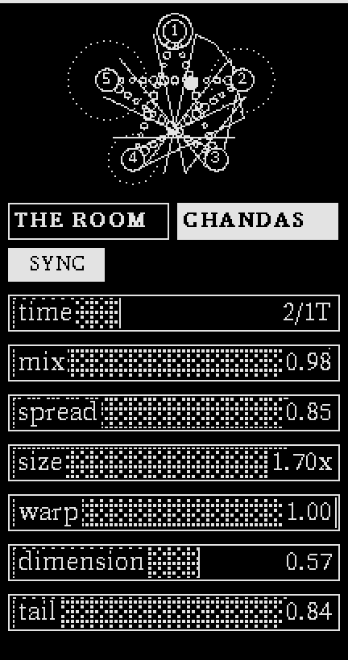
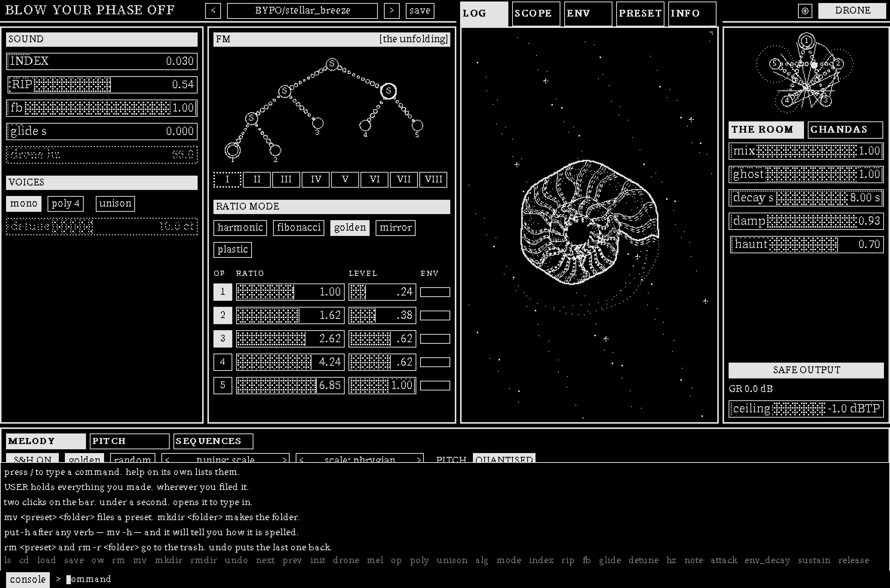

<a id="top"></a>
<p align="center">
  <picture>
    <source media="(prefers-color-scheme: light)" srcset=".github/readme/wordmark-light.svg">
    
  </picture>
</p>

<p align="center">
  <a href="https://github.com/akindoflikeness/bypomono/releases/latest"></a>
  <a href="LICENSE"></a>
  
  <a href="https://discord.com/invite/xBtGXU7Etf"></a>
  
</p>

<p align="center">
  <a href="https://akindoflikeness.net"><b>Website</b></a> ·
  <a href="https://www.youtube.com/@akindoflikeness"><b>YouTube</b></a> ·
  <a href="#download"><b>Download</b></a> ·
  <a href="#install"><b>Install</b></a>
</p>

<br>

<p align="center">
  
</p>

<p align="center"><b>One tone, many voices.</b> An untamed, opinionated instrument that uses<br>mathematical irrationality to reach uniquely stable inharmonic timbres.</p>

<br>

<pre align="center">
┌────────────────────────────────────────────────────────────────────┐
│  <a href="#download">DOWNLOAD</a>  ·  <a href="#install">INSTALL</a>  ·  <a href="#build-from-source">BUILD</a>  ·  <a href="#algorithmic-phase-modulation">PM</a>  ·  <a href="#phase-violence">VIOLENCE</a>  ·  <a href="#operator-structures">OPERATORS</a>  │
│     <a href="#chambers">CHAMBERS</a>  ·  <a href="#ratio-palettes">RATIOS</a>  ·  <a href="#progenitor">PROGENITOR</a>  ·  <a href="#output">OUTPUT</a>  ·  <a href="#console">CONSOLE</a>      │
│                   <a href="#playing">PLAYING</a>  ·  <a href="#presets">PRESETS</a>  ·  <a href="#on-ai">ON AI</a>                    │
└────────────────────────────────────────────────────────────────────┘
</pre>

<br>

## Download

<table align="center">
<tr>
<td align="center"><a href="https://github.com/akindoflikeness/bypomono/releases/latest/download/bypomono-linux-x86_64.tar.gz"></a></td>
<td align="center"><a href="https://github.com/akindoflikeness/bypomono/releases/latest/download/bypomono-macos-arm64.zip"></a></td>
<td align="center"><a href="https://github.com/akindoflikeness/bypomono/releases/latest/download/bypomono-macos-x86_64.zip"></a></td>
<td align="center"><a href="https://github.com/akindoflikeness/bypomono/releases/latest/download/bypomono-windows-x64.zip"></a></td>
</tr>
<tr>
<td align="center"><sub><a href="https://github.com/akindoflikeness/bypomono/releases/latest/download/bypomono-linux-x86_64-SHA256SUMS.txt">SHA256SUMS</a></sub></td>
<td align="center"><sub><a href="https://github.com/akindoflikeness/bypomono/releases/latest/download/bypomono-macos-arm64-SHA256SUMS.txt">SHA256SUMS</a></sub></td>
<td align="center"><sub><a href="https://github.com/akindoflikeness/bypomono/releases/latest/download/bypomono-macos-x86_64-SHA256SUMS.txt">SHA256SUMS</a></sub></td>
<td align="center"><sub><a href="https://github.com/akindoflikeness/bypomono/releases/latest/download/bypomono-windows-x64-SHA256SUMS.txt">SHA256SUMS</a></sub></td>
</tr>
</table>

## Install

<p align="center">
  <picture>
    <source media="(prefers-color-scheme: light)" srcset=".github/readme/clap-logo-black.png">
    
  </picture>
</p>

<pre>
LINUX
&nbsp;
Download      →  <a href="https://github.com/akindoflikeness/bypomono/releases/latest/download/bypomono-linux-x86_64.tar.gz">bypomono-linux-x86_64.tar.gz</a>
Extract
Run           →  ./blow-your-phase-off-gui
Copy .clap    →  to the directory your DAW indexes
</pre>

<pre>
MACOS
&nbsp;
Download      →  [Intel]   <a href="https://github.com/akindoflikeness/bypomono/releases/latest/download/bypomono-macos-x86_64.zip">bypomono-macos-x86_64.zip</a>
                 [Silicon] <a href="https://github.com/akindoflikeness/bypomono/releases/latest/download/bypomono-macos-arm64.zip">bypomono-macos-arm64.zip</a>
Extract
Clear quarantine → xattr -dr com.apple.quarantine &lt;folder&gt;
Right click to open  →  BYPO.app
Copy .clap    →  to the directory your DAW indexes  [~/Library/Audio/Plug-Ins/CLAP/]
</pre>

<pre>
WINDOWS
&nbsp;
Download      →  <a href="https://github.com/akindoflikeness/bypomono/releases/latest/download/bypomono-windows-x64.zip">bypomono-windows-x64.zip</a>
Extract
Run           →  blow-your-phase-off.exe
Copy .clap    →  to the directory your DAW indexes  [%COMMONPROGRAMFILES%\CLAP\]
&nbsp;
Windows version hasn't been fully tested by myself yet.
</pre>

## Build from source

```sh
git clone https://github.com/akindoflikeness/bypomono.git && cd bypomono
make                                   # standalone, blow-your-phase-off-gui
make check                             # engine tests
git clone --depth 1 https://github.com/free-audio/clap /tmp/clap
make bypo.clap EXTRA_CPPFLAGS=-I/tmp/clap/include   # the plugin
```

Package names, the ones the CI runners use:

```sh
# Debian / Ubuntu
sudo apt install build-essential pkg-config libsdl2-dev libfreetype-dev libasound2-dev libx11-dev
# macOS
brew install pkg-config make cmake        # SDL2 and FreeType are built from source by .github/macos-deps.sh
# Windows, MSYS2 MINGW64 shell
pacman -S make git mingw-w64-x86_64-gcc mingw-w64-x86_64-pkgconf mingw-w64-x86_64-SDL2 mingw-w64-x86_64-freetype
# Fedora
sudo dnf install gcc make pkgconf-pkg-config SDL2-devel freetype-devel alsa-lib-devel libX11-devel
```

<br>

## Algorithmic Phase Modulation

The architecture is PM with a dual algorithm selector: the arrangement of
modulators, carriers and feedback is chosen by roman numeral I to VIII, and the
ratio palette supplies five named starting configurations for operators 1–5.
Loading a palette writes those five ratios directly to the operators; their
ratios can then be tuned independently and are preserved when the algorithm
changes.
PM depth is tuned through these recursive algorithms



## Phase Violence

<table>
<tr>
<td width="50%" valign="top">

There are some additional controls that allow for even deeper timbral exploration that I encourage you to experiment with those being
RIP, haunt, and ghost. Operators can be turned off removing not only its signal from the output but from the modulation signal chain.
I'd highly recommend experimenting with turning off operators to find unique mixtures (especially in conjunction with The Room's ghost).

A sum of the carriers leaks into a short delay through an all pass filter to actively try to cause phase cancellation by modulating the phase of the voice with its own altered past. The delay and the phase rotation of the allpass filter work together - bending time to modulate away the voice, the modulation rarely manages to stop the voice - merely tearing it apart as it drones on.

</td>
<td width="50%" align="center"></td>
</tr>
</table>

## Operator Structures

<table align="center">
<tr>
<td valign="top"><pre>I · SSSS
&nbsp;
[1]↺
 │
[2]
 │
[3] [4]
 └─┬─┘
  [5]
══╧══ out</pre></td>
<td valign="top"><pre>II · SSSP
&nbsp;
[1]↺
 │
[2]
 │
[3]
 │
[4] [5]
═╧═══╧═ out</pre></td>
<td valign="top"><pre>III · PSSP
&nbsp;
[1]↺
 │
[2]
 │
[3] [4] [5]
═╧═══╧═══╧═ out</pre></td>
<td valign="top"><pre>IV · PPSP
&nbsp;
[1]↺
 │
[2] [3] [4] [5]
═╧═══╧═══╧═══╧═ out</pre></td>
</tr>
<tr>
<td valign="top"><pre>V · PPPP
&nbsp;
[1]↺[2] [3] [4] [5]
═╧═══╧═══╧═══╧═══╧═ out</pre></td>
<td valign="top"><pre>VI · PPPF
&nbsp;
            [4]
             │
[1] [2] [3] [5]↺
═╧═══╧═══╧═══╧═ out</pre></td>
<td valign="top"><pre>VII · PPFF
&nbsp;
[1]     [4]
 │       │
[2]↺[3] [5]
═╧═══╧═══╧═ out</pre></td>
<td valign="top"><pre>VIII · PFFF
&nbsp;
[1]
 │
[2] [4]
 │   │
[3]↺[5]
═╧═══╧═ out</pre></td>
</tr>
</table>


| #    | ID     | Structure                                         | Carriers | Max depth | Feedback on        |
| ---- | ------ | ------------------------------------------------- | -------- | --------- | ------------------ |
| I    | `SSSS` | full FM tree: `(1→2→3)` and `4` both modulate `5` | 1        | 4         | op 1 (depth 4)     |
| II   | `SSSP` | true 4-op stack `1→2→3→4`, plus sine `5`          | 2        | 4         | op 1 (depth 4)     |
| III  | `PSSP` | 3-op stack `1→2→3`, plus sines `4`, `5`           | 3        | 3         | op 1 (depth 3)     |
| IV   | `PPSP` | FM pair `1→2`, plus sines `3`, `4`, `5`           | 4        | 2         | op 1 (depth 2)     |
| V    | `PPPP` | five independently tuned parallel sines (additive) | 5        | 1         | op 1 (depth 1)     |
| VI   | `PPPF` | FM pair `4→5`, plus sines `1`, `2`, `3`           | 4        | 2         | **op 5 (depth 1)** |
| VII  | `PPFF` | FM pairs `1→2` and `4→5`, plus sine `3`           | 3        | 2         | **op 2 (depth 1)** |
| VIII | `PFFF` | 3-op stack `1→2→3` and FM pair `4→5`              | 2        | 3         | **op 3 (depth 1)** |

<br>

## Chambers

<table>
<tr>
<td width="50%" valign="top">

The Room is a uniquely close sounding reverb with a dirty tank and a modulation linked dampener (via field).
It has its own tricks with haunt and ghost that have novel effects, and of course The Room was structured using fibonacci recursion.
Here it was used to define phase offsets via the all pass filter networks.

</td>
<td width="50%" align="center"></td>
</tr>
</table>

## Ratio Palettes

<!-- The values below are read from src/dsp/patch.c (ratio_mode_ratio). -->

<table align="center">
<tr>
<td valign="top"><pre>harmonic
&nbsp;
op  1  2  3  4  5
×   1  2  3  4  5
&nbsp;
rₙ = n</pre></td>
<td valign="top"><pre>fibonacci
&nbsp;
op  1  2  3  4  5
×   1  1  2  3  5
&nbsp;
rₙ = Fₙ</pre></td>
<td valign="top"><pre>golden  ·  default
&nbsp;
op  1     2     3     4     5
×   1     φ     φ²    φ³    φ⁴
&nbsp;
rₙ = φⁿ⁻¹    φ = 1.618…</pre></td>
</tr>
<tr>
<td valign="top"><pre>mirror
&nbsp;
op  1     2     3     4     5
×   φ⁻²   φ⁻¹   1     φ     φ²
&nbsp;
rₙ = φⁿ⁻³</pre></td>
<td valign="top"><pre>plastic
&nbsp;
op  1     2     3     4     5
×   1     ρ     ρ²    ρ³    ρ⁴
&nbsp;
rₙ = ρⁿ⁻¹    ρ = 1.3247…</pre></td>
<td valign="top"><pre>&nbsp;
&nbsp;
φ² = φ + 1
ρ³ = ρ + 1
&nbsp;</pre></td>
</tr>
</table>

<br>

## Progenitor

<table>
<tr>
<td width="50%" align="center"></td>
<td width="50%" valign="top">

**Chandas listens to the signal before and after we do.** It's a unique granular delay that can sync with the internal sequencer.
Whilst syncing it has a polyrhythmic texture though Chandas also features its own massive lush reverb with two multi controls to tune
its bloom.

Named chandas, the ancient Indian study of Sanskrit poetic metre. In the work traditionally attributed to Pingala, long and short syllables were systematically arranged and enumerated, producing mathematical structures we now recognise in terms of binary combinatorics and the Fibonacci sequence.

</td>
</tr>
</table>

## Output

The signal path is transparent: nothing colours the sound after Chandas.
The output fader sets the level from -24 to +24 dB, saved with each preset,
so a quiet patch can be brought up. It feeds SAFE OUTPUT, a true-peak limiter
that holds everything under -1 dBTP; the GR readout shows how hard it is
working.

## Console

<p align="center"></p>

Press `/` or click `console` in the bottom bar. Everything on screen can be
reached from it, and `help` lists the verbs.

<pre>
presets     ls  cd  load  save  ow  rm  mv  mkdir  rmdir  undo  next  prev  init
sound       every control by name: index rip fb glide detune mix ghost ...
midi        map a CC to a control with mod cc, or all of them off
recording   rec starts a take, rec again finishes it
</pre>

Put `-h` after any verb and it tells you how it is spelled. Removed presets go
to a trash folder, and `undo` puts back the last one.

Takes are 48 kHz 32-bit float .wav files in your Music folder, under BYPO.
The instrument runs at 48 kHz on your default output device and is fully MIDI
compatible.

## Playing

<table>
<tr>
<td valign="top"><pre>VOICES
&nbsp;
mono · poly 4 · unison
detune spreads the voices
DRONE holds a note open</pre></td>
<td valign="top"><pre>MELODY
&nbsp;
sample and hold, golden or random
tuning, scale, rate, range, root
SYNC locks it to the clock</pre></td>
<td valign="top"><pre>PITCH
&nbsp;
16 steps: pitch, gate, velocity
step length, sequence length, root
12-TET snaps steps to semitones
gate sets how long each step holds</pre></td>
<td valign="top"><pre>SEQUENCES
&nbsp;
8 slots of 16 painted values
each routed to any control</pre></td>
</tr>
</table>

The display column switches between LOG, SCOPE, ENV (the ADSR), PRESET (the
browser) and INFO.

## Presets

┌──────────┬─────────────────────────────────────────────┐
│ Platform │                Your presets                 │
├──────────┼─────────────────────────────────────────────┤
│ Linux    │ ~/.local/share/bypo/presets/                │
├──────────┼─────────────────────────────────────────────┤
│ macOS    │ ~/Library/Application Support/bypo/presets/ │
├──────────┼─────────────────────────────────────────────┤
│ Windows  │ %APPDATA%\bypo\presets\                     │
└──────────┴─────────────────────────────────────────────┘

The shipped bank lives in presets/BYPO/ beside the app. On first run the app copies it into your folder under BYPO/, and anything you save lands in your folder from then on. Presets are plain JSON, one file each, the filename is the preset's name.

73 in the core bank · `presets/BYPO/*.json`

<pre>
4evasolo            eddie_the_eagle     minority            shun
BRUTALISM           eleventeen          miopic              slinky
Fluffy              fall_of_rome        moaner              space_battleships
GlassD              fibbing             mr_bojangles        stellar_breeze
Summon              filthy_plucker      mustang_ballaie     storyteller
Woofer              fromheavenabove     narsty              symmetriad
barbershop          ghetto              neo_bass            test_flip_point
binky               goodbye-            net_terminal_gene   the_conch
bong                hexD                nightmares          the_nine
chakra              hexD_alt            one                 throaty
church              hmm                 orthogonal          thudner
cinematic           init                oslo                tokyo_ghost
click               instability         phraze              unbeknownst
clog                it_had_the_power    plinky              washed_out
crash               jiggle_physics      present             wet_bong
default             landoger            pressure            wibbly
discovered_harmony  lil_glider          saturated_woof
drama               logarhythm          shim
drifting            mathsmatic          shuffling_a_deck
</pre>

## On AI

Without AI this wouldn't exist. Primarily it has been programmed by AI agents. Every change is read, committed and tested by hand and the design and audio architecture are mine (akindoflikeness/AKOL). AI is not exclusively a force for good, and has been especially damaging in music and the arts generally. This is written to be open so that you can make an informed decision about whether to engage with it or not. 

<br>

<pre align="center">
══════════════════════════════════════════════════════════════════
     MIT · BYPOSerif, Unifont Ex Mono · SDL2 · FreeType     
  see <a href="THIRD-PARTY-LICENSES.txt">THIRD-PARTY-LICENSES.txt</a>
  <a href="#top">↑ top</a>
══════════════════════════════════════════════════════════════════
</pre>
